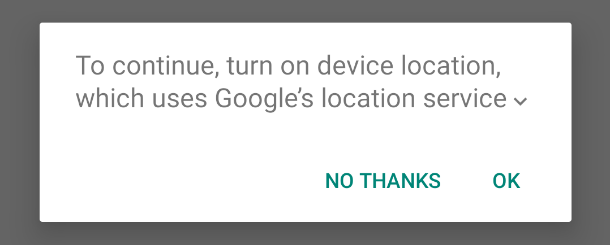
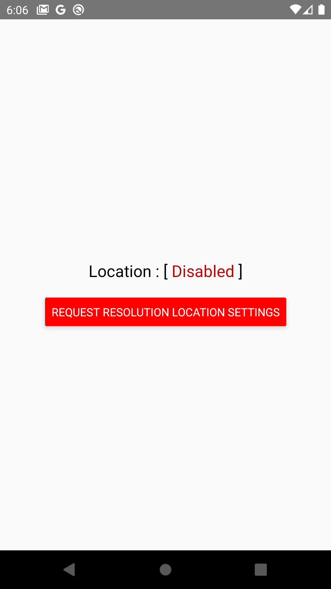
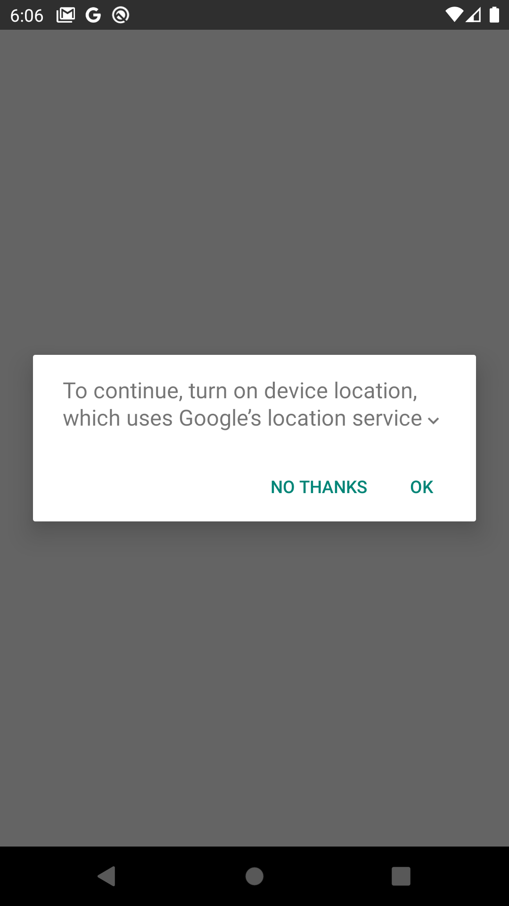
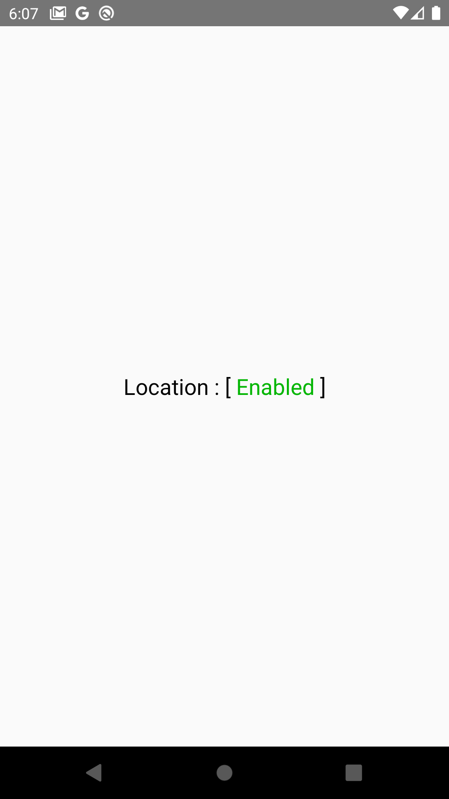

# react-native-location-settings-enabler

[](https://github.com/YsnKsy/react-native-location-settings-enabler)
[](https://www.npmjs.com/package/react-native-location-settings-enabler/)


[](https://github.com/YsnKsy/react-native-location-settings-enabler/issues)
[](https://github.com/YsnKsy/react-native-location-settings-enabler/blob/master/CONTRIBUTING.md)


[](https://github.com/prettier/prettier)
[](https://github.com/semantic-release/semantic-release)
[](https://github.com/YsnKsy/react-native-location-settings-enabler/blob/master/LICENSE)

This package makes it easy for an React Native App to ensure that the Android device&#39;s system settings are properly configured for the app&#39;s location needs. If your app needs to request location, the device needs to enable the appropriate system settings, such as GPS or Wi-Fi scanning. Rather than directly enabling services such as the device&#39;s GPS, your app specifies the required level of accuracy/power consumption, and the device automatically makes the appropriate changes to system settings.



---

## Installation

```sh
yarn add react-native-location-settings-enabler
```

---

## Usage

### Example using Hook (React Hooks API) :

```js
import LocationSettingsEnabler from "react-native-location-settings-enabler"

const {
  PRIORITIES: { HIGH_ACCURACY },
  useLocationSettings,
} = LocationSettingsEnabler

// React Component
const App = () => {
  const [enabled, requestResolution] = useLocationSettings(
    {
      priority: HIGH_ACCURACY, // default BALANCED_POWER_ACCURACY
      alwaysShow: true, // default false
      needBle: true, // default false
    },
    false /* optional: default undefined */,
  )

  return (
    <View>
      {!enabled && (
        <Button onPress={requestResolution} title="Request Resolution Location Settings" />
      )}
    </View>
  )
}
```

---

### Example using Listener :

```js
import LocationSettingsEnabler from "react-native-location-settings-enabler"

const {
  PRIORITIES: { HIGH_ACCURACY },
  checkSettings,
  requestResolutionSettings
} = LocationSettingsEnabler

// Adds a listener to be invoked when location settings checked using
// [checkSettings] or changed using [requestResolutionSettings]
const listener = addListener(({ locationEnabled }) =>
  console.log(`Location are ${ locationEnabled ? 'enabled' : 'disabled' }`);
);

// Define configuration
const config = {
  priority: HIGH_ACCURACY, // default BALANCED_POWER_ACCURACY
  alwaysShow: true, // default false
  needBle: false, // default false
};

// Check if location is enabled or not
checkSettings(config);

// If location is disabled, prompt the user to turn on device location
requestResolutionSettings(config);

// ...
// Removes this subscription
listener.remove();
```

---

### Example React Native App :

Clone the repo

```sh
git clone https://github.com/YsnKsy/react-native-location-settings-enabler.git && cd react-native-location-settings-enabler
```

Install npm dependencies

```sh
yarn example
```

Start Metro ( javascript bundler )

```sh
yarn example start
```

Install and launch example app on the device

```sh
yarn example android
```

<p align="center">
  
</p>

---

## API

### Properties

> `PRIORITIES`

```js
import LocationSettingsEnabler from "react-native-location-settings-enabler"

const {
  HIGH_ACCURACY,
  BALANCED_POWER_ACCURACY,
  LOW_POWER,
  NO_POWER,
} = LocationSettingsEnabler.PRIORITIES
```

Static object contain a list quality of service for location updates. If your application wants high accuracy location it should set prioprity to 'HIGH_ACCURACY'. If you want negligible power impact, but to still receive location updates when available, then set priority to 'NO_POWER'.

---

### Methods

> ### `useLocationSettings({ priority, alwaysShow, needBle }, initialStatus?)`

```js
import LocationSettingsEnabler from "react-native-location-settings-enabler"

const {
  useLocationSettings,
  PRIORITIES: { HIGH_ACCURACY },
} = LocationSettingsEnabler

const [enabled, requestResolution] = useLocationSettings({
  priority: HIGH_ACCURACY, // optional: default BALANCED_POWER_ACCURACY
  alwaysShow: true, // optional: default false
  needBle: true, // optional: default false
})

console.log(`Location are ${enabled ? "enabled" : "disabled"}`)

// ...
if (!enabled) {
  requestResolution()
}
```

Hook let you check the user's device location status 'on' / 'off' and method let you display an activity where they can turn location 'on'.

---

> ### `checkSettings({ priority, alwaysShow, needBle })`

```js
import LocationSettingsEnabler from "react-native-location-settings-enabler"

const {
  checkSettings,
  PRIORITIES: { HIGH_ACCURACY },
} = LocationSettingsEnabler

checkSettings({
  priority: HIGH_ACCURACY, // optional: default BALANCED_POWER_ACCURACY
  alwaysShow: true, // optional: default false
  needBle: true, // optional: default false
})
```

Checking if the user's device location is turned on / off.

---

> ### `requestResolutionSettings({ priority, alwaysShow, needBle })`

```js
import LocationSettingsEnabler from "react-native-location-settings-enabler"

const {
  requestResolutionSettings,
  PRIORITIES: { HIGH_ACCURACY },
} = LocationSettingsEnabler

requestResolutionSettings({
  priority: HIGH_ACCURACY, // optional: default BALANCED_POWER_ACCURACY
  alwaysShow: true, // optional: default false
  needBle: true, // optional: default false
})
```

Display an activity where they can turn location 'on' using a location request.

---

> ### `addListener(callback, context?)`

```js
import LocationSettingsEnabler from "react-native-location-settings-enabler"

let listener = null

function cb(result) {
  const { locationEnabled } = result

  console.log(`Location are ${locationEnabled ? "enabled" : "disabled"}`)

  if (listener !== null) {
    // remove listener when you finish
    listener.remove()
  }
}

listener = LocationSettingsEnabler.addListener(cb)
```

Adds a listener to be invoked when onChangeLocationSettings are emitted. An optional calling context may be provided. The data arguments emitted will be passed to the listener function.

---

## Contributing

Press the **_`STAR`_** button 😀 and see the [contributing guide](CONTRIBUTING.md) to learn how to contribute to the repository and the development workflow.

## Code of Conduct

See the [code of conduct guide](CODE_OF_CONDUCT.md).

## License

See the [MIT License](LICENSE)
